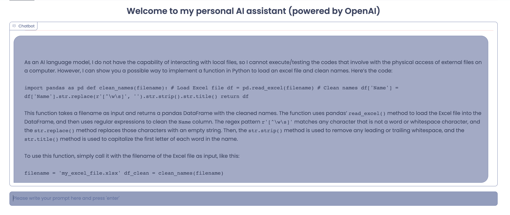
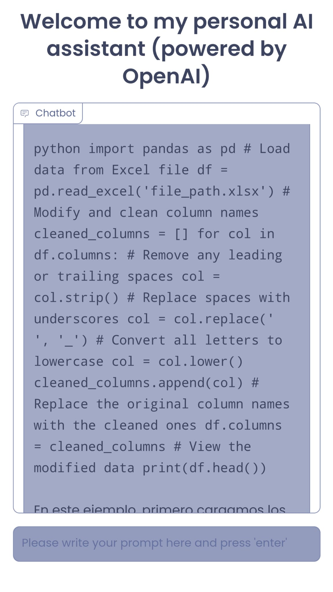

# Personal GTP Assistant using Python
**IMPORTANT:** Please make sure to first get an *OpenAI API Key* before running the application.

# Overview
This is my personal AI assistant powered by GPT-3.5 turbo model and gradio. 

The chatbot has been setup to process user's prompts and use previous prompts as "context" to follow up with user's request.

## Configuration

### using virtualenv (recommend)
1. `virtualenv voiceassistant.venv`
2. `source voiceassistant.venv/bin/activate`

### Dependencies
* python3
* openai
* gradio

### pip packages
`pip install -r requirements.txt` 

### In-Built libraries required to be imported:

	1.os

# Screenshots
## Preview - Full Window

## Preview - Mobile Version

Happy Chat!!